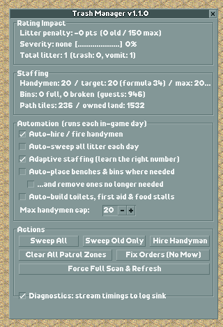
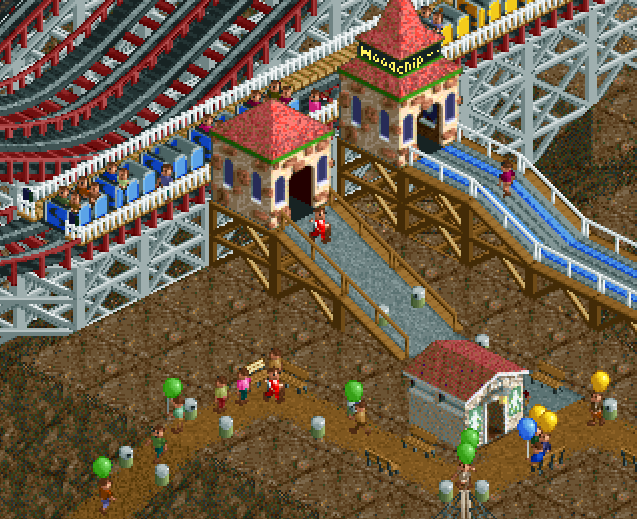
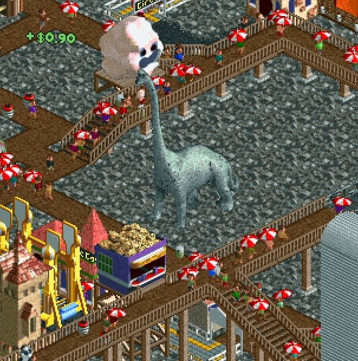
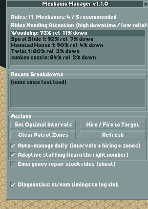
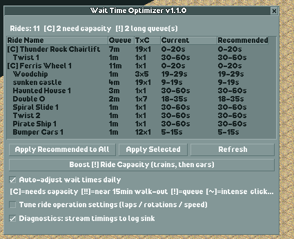
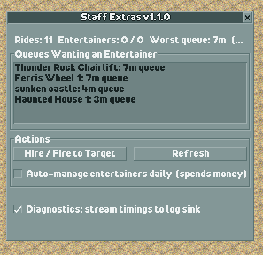
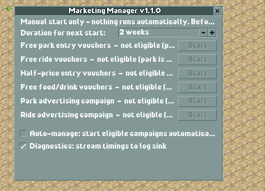

# OpenRCT2 Park Management Plugins

Seven plugins for [OpenRCT2](https://openrct2.io/) that handle the routine parts of running a
park: hiring the right number of staff, keeping paths clean, tuning ride wait times, and a
few jobs the game leaves entirely to you.

Every decision is based on what's actually happening in your park, not on a fixed ratio.
If the park is clean with 20 handymen, the plugin won't hire 40 because a formula says so.

[Download the latest release](../../releases/latest) · [User guide](docs/user-guide.md) · [MIT license](LICENSE)

---

## The plugins

| Plugin | In one line | Spends money by default? |
|---|---|---|
| [Trash Manager](#trash-manager) | Keeps paths clean | Yes: handyman wages |
| [Auto-Builder](#auto-builder) | Builds benches, bins and stalls where guests need them | Yes: benches, bins and stalls where needed (#51) |
| [Mechanic Manager](#mechanic-manager) | Keeps rides running | No |
| [Wait Time Optimizer](#wait-time-optimizer) | Keeps queues from getting out of hand | No |
| [Staff Extras](#staff-extras) | Puts entertainers where queues need them | Yes: entertainer wages (#51) |
| [Marketing Manager](#marketing-manager) | Shows which campaigns are worth the money | No (off until you turn it on) |
| [Path Connector](#path-connector-experimental) (experimental) | Draws a footpath between two tiles | Only for paths you choose to build |

Each one adds an entry to the map menu in the top toolbar, which opens its window.

### Trash Manager

Handles handymen and litter.



- **Handyman staffing.** It starts from the usual guests-and-paths estimate, then works
  down while the park stays clean and hires back quickly once litter starts to hurt the
  rating. On the test park the usual formula asked for 42 handymen; the park stayed at top
  rating with 36.
- **Vomit tracking.** On most parks nearly all litter is vomit, not dropped rubbish. The
  plugin works out which ride is making guests sick and whether that ride needs benches
  near its exit. Guests sitting on a bench recover from nausea, so benches prevent most of
  that mess before it happens. (Auto-Builder does this; see below.)

### Auto-Builder

Places benches and bins and builds guest facilities. Split out of Trash Manager in 1.5
(#84); a save keeps the choices it had in Trash Manager.

- **Benches and bins** *(on by default, can be switched off)*. Places benches at nauseating ride exits and vomit
  hotspots, bins near food stalls, and a light spread of both across the rest of the path
  network.
- **Toilets, first aid and food stalls** *(on by default, can be switched off)*. Builds a facility only when guests
  in one area have kept going without one across five full passes over the park, so a
  crowd that happens to be passing through doesn't trigger a build.



*Everything here was placed by the plugin: the toilet, the benches and the bins along the
path below the Woodchip coaster.*



*A food stall the plugin built on a raised walkway. It is placed at the height of the path it serves.*

### Mechanic Manager

Handles mechanics, inspections and breakdowns.



- **Mechanic staffing.** Works the same way as the handyman controller. The main signal is a
  ride that has been broken for two days or more: one that breaks and gets fixed the same
  day means the current mechanics are coping. A mechanic is let go only when fewer than half
  the fleet has done a job in the last 14 days, and the one idle longest goes first.
- **Inspection intervals.** Re-applies the inspection interval every day. Opening a
  ride's construction window quietly resets it, and most players never notice.
- **Patrol zones.** Clears mechanic patrol zones so any mechanic can reach any ride.
- **Emergency repair** *(on by default, and a cheat)*. Clears the breakdown on a ride that has
  been broken for three days or more. It's there for rides the game's pathfinding can't get
  a mechanic to. It restores no reliability, and the three-day wait keeps it from replacing
  mechanics altogether.

### Wait Time Optimizer

Handles ride wait settings and queue length.



- **Wait times.** Sets each ride's minimum and maximum wait from its cycle length and number
  of trains, and applies them daily.
- **Capacity warnings.** If a ride's queue stays long even with good settings, the ride needs
  more trains or cars rather than more tuning, and the plugin tells you which rides those
  are.
- **Queue override.** Guests give up and leave a queue after a while. When a queue is
  approaching that point, or has been growing for two days running, the plugin lets trains
  leave sooner so the line moves.
- **Ride operation tuning** *(optional)*. Shortens the cycle (laps, rotations, time limit) on
  rides with long queues and lengthens it on quiet ones. Each change resets the ride's
  ratings until it runs again, so it changes things one step at a time.

### Staff Extras

Handles entertainers. On by default since [#51](https://github.com/MatthewT1/matts-openrct2-plugins/issues/51); switch it off in the window if you'd rather not pay their wages.



Hires entertainers and places them at queues that are close to the point where guests walk
out, because that's where an entertainer makes the most difference. It only ever fires
entertainers it hired itself, so the ones you placed by a themed ride stay put.

Once the park has 20 or more staff and no security guard, it also hires one guard. The Best
Staff award (+25% new guests while held) needs every staff type on the roster (#92).

### Marketing Manager

Handles advertising and voucher campaigns.



Ranks every campaign by what each extra guest it brings in is likely to cost,
based on your park's current prices and capacity. Some campaigns are much worse value than
they look. Free-entry vouchers, for example, do very little if your entry fee is already
low. You can start campaigns from the list yourself, or let it run them within a spending
limit. It won't advertise while the park is already full, unless your scenario objective
needs more guests.

The game doesn't let plugins see which campaigns are running, so this window keeps its own
record, saved with the park.

### Path Connector (experimental)

> **Experimental.** Path Connector has not been reviewed and has no automated tests, and
> picking a tile is known to be unreliable ([#30](https://github.com/MatthewT1/matts-openrct2-plugins/issues/30)). Save before using it.

A building tool, not automation. Pick two tiles and it plans a footpath between them,
routing around rides and scenery, and warns you about problems before you build. Nothing
runs in the background.

---

## What the plugins won't do

- **Spend money you can't switch off.** Benches, bins, stalls and entertainers are on by
  default because testing showed they pay off in a cleaner park
  ([#51](https://github.com/MatthewT1/matts-openrct2-plugins/issues/51)); each has its own
  toggle. Campaigns and ride operation tuning stay off until you tick them.
- **Demolish anything.** Facility building only ever adds.
- **Remove your things.** The bench and bin clean-up only touches items the plugin
  placed itself. Anything you placed by hand is left alone.
- **Slow the game down.** Every periodic job has been timed on a 1,000-guest park. Most
  take 3 ms or less, and the heaviest (a full map scan, at most once every 30 seconds)
  takes about 14 ms.

---

## Install

1. Download the `.js` files from the [latest release](../../releases/latest). Take all seven,
   or only the ones you want. Each plugin works on its own.
2. Put them in your OpenRCT2 `plugin` folder:

   | System | Folder |
   |---|---|
   | Windows | `Documents\OpenRCT2\plugin\` |
   | macOS | `~/Library/Application Support/OpenRCT2/plugin/` |
   | Linux | `~/.config/OpenRCT2/plugin/` |

3. Start OpenRCT2 and load a park. Plugins load when a park loads, so if the game is already
   running, go back to the title screen and load the park again.

You'll need a recent OpenRCT2 build (plugin API version 87 or later). Settings are saved in
each park file, so different parks can use different settings.

---

## For developers

The plugins are written in TypeScript and bundled with rollup into one `.js` file each.

```bash
npm install
npm run build:dev   # build and copy straight into your OpenRCT2 plugin folder
npm run build       # release build into ./dist
npm test            # unit tests
npm run typecheck
```

The decision-making code is kept apart from the code that talks to the game. Files such as
`staffing.ts`, `needs.ts` and `marketing.ts` take plain numbers in and return decisions,
so they can be tested without the game running. The seven plugin files connect those
decisions to the game. Their behaviour in a real park is checked with an optional
diagnostics feed: tick **Diagnostics** in any plugin window, run `node tools/log-sink.mjs`,
and timings and counters are written to `tools/rct-debug.log`.

Every push is type-checked, tested and built by GitHub Actions. Pushing a tag such as
`v1.0.0` publishes a release with the seven plugin files attached.

Start with [NOTES.md](NOTES.md) for the project layout, build details and a list of API
traps found along the way. Deeper material:

- [API reference](docs/api-reference.md): plugin API behaviour, each point checked against the game source
- [Performance](docs/performance.md): what things cost and the rules that keep plugins fast
- [Design records](docs/design-records.md): why each feature works the way it does, including ideas that were measured and dropped
- [Research](docs/research.md): game mechanics and community strategy
- [Project history](docs/HISTORY.md)

## How this was built

These plugins were written with [Claude Code](https://claude.com/claude-code), Anthropic's
AI coding tool, over several sessions of playing and fixing. The models involved were
Claude Sonnet 4.6, Opus 5, Sonnet 5 and Opus 5.5, with Haiku 4.5 and Sonnet running
smaller research and build tasks alongside them.

It wasn't written from guesswork about how the game works. Two things kept it honest:

- **The game's own source code.** A local copy of the OpenRCT2 source was the reference for
  every question about the plugin API: what a value means, what units it's in, and why an
  action gets refused. Those answers are written up in the
  [API reference](docs/api-reference.md), each one cited to a file and line. Several turned
  out to be different from what the documentation or common sense suggested. For example,
  money is stored in tenths of a pound, not hundredths, and an in-game day is about 530
  ticks, not 8,192.
- **Data from real play.** Each plugin can stream timings and counters from a running game.
  While I played, that data was read back and used to set thresholds, find slow code and
  catch features that were quietly doing nothing. Most design choices in
  [design records](docs/design-records.md) point to a measurement, and a few ideas were
  dropped because the data showed they wouldn't help.

The decision logic is also covered by unit tests (`node tests/run.mjs` prints the count), several of which exist because they
caught a real bug first.

## License

[MIT](LICENSE). Use it, change it, mix it into your own plugins. Just keep the license notice.
